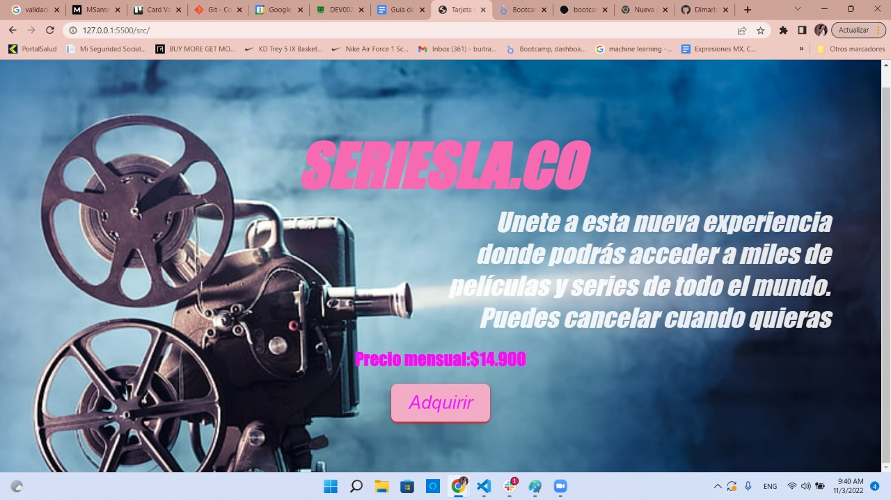
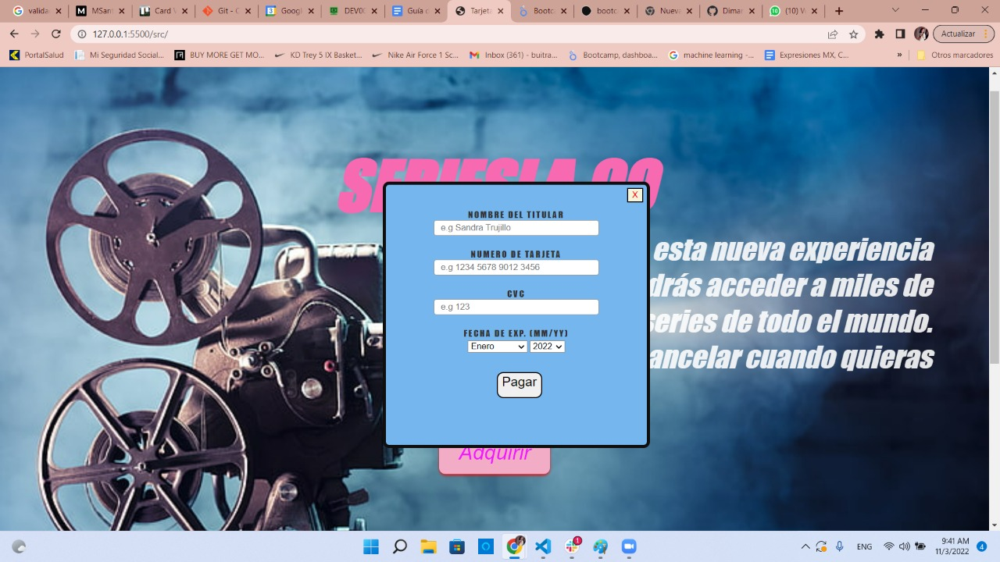
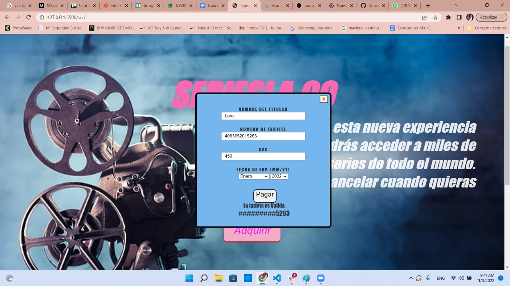

# Tarjeta de crédito válida

## Índice

* [1. Resumen del proyecto](#1-Resumen-del-proyecto)
* [2. Prototipo en papel](#2-Prototipo-en-papel)
* [3. Feedback de compañeras](#3-Feedback-de-compañeras)
* [4. Prototipo Final](#4-Prototipo-Final)
* [5. Feedback OH](#5-Feedback-OH)
* [6. Investigacion UX](#6-Investigacion-UX)

***

## 1. Resumen del Proyecto
Decidi guiarme en el lado de las series, inspirandome con las pagina de peliculas o series que existen hoy en dia, es una pagina sencila
donde se pueda entender para el usuario a la hora de hacer una subscripcion.

## 2. Prototipo en papel

## 3. Feedback de compañeras
Les agrada el nombre de la pagina y el diseño de esta.

## 4. Prototipo Final

***

***

## 5. Feedback OH
En la Office Hours me explicaron como terminar la funcion de Algoritmo de Luhn ya que tenia una cosa que no funcionaba, 
y me explico en como estaba estructurada en el proyecto. Tuvo buenos comentarios sobre el diseño.

## 6. Investigacion UX
#### 'Quienes son los principales usuarios y objetivos en relación con el producto?'
Son las personas que tienen gusto en el lado de las series o peliculas y les gustaria adquirir una membresia. 
### 'Objetivos en relación con el producto.'
Dar una breve descripcion donde se explique lo que pueden ver en la pagina, haciendo facil para el usuario
poder adquirirlo. La informacion bancaria no sera compartida con nadie ya que se encripta la informacion de confirmacion. 
### 'Como soluciona los problemas/necesidades de usuarios?'
Se enforca en ayudar a las personas en no salir de sus casas a comprar una pelicula o novela y gastar dinero en solo un producto, 
Si no que en esta pagina ayuda a que por un valor puedas obtener muchas peliculas sin tener que salir de la casa. i

